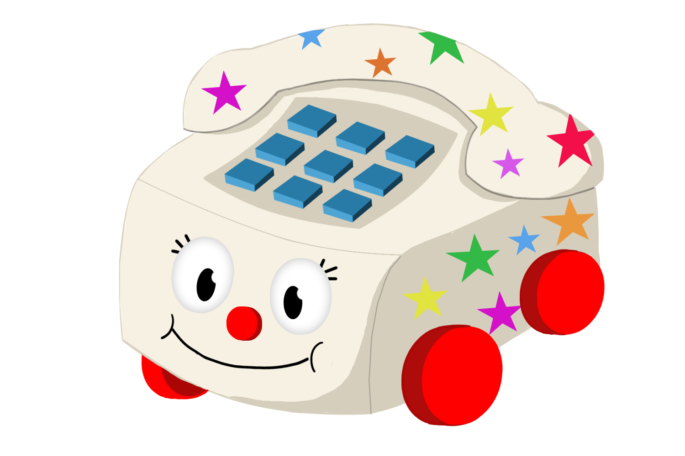
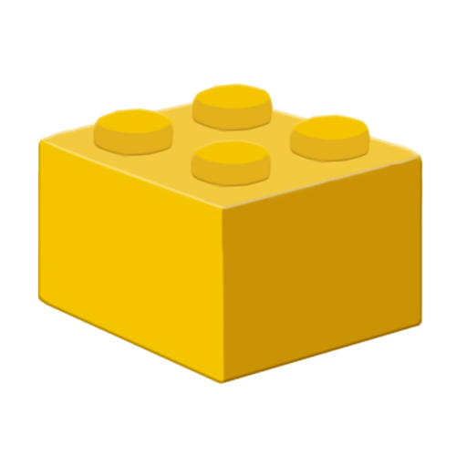

# Braking Down
**Idea General:**

     

**Contexto Histórico:**

Europa, siglo XXI. Concretamente, el año 2017. Lucho nació en el seno de una familia de clase media europea. Vive con sus padres y su hermano mayor en un chalé a las afueras de la capital. La situación en su país es bastante buena. El gobierno ha puesto mucho empeño en la clase media, lo que hizo que familias como las de Lucho pudieran tener un nivel de vida mucho mejor que el que tenían hace 10 años.

**Descripción breve del juego:**

En un pequeño pueblo de Wisconsin, Lucho, un pequeño niño de un año ha decidido que es hora de jugar. Es invierno, por lo que hace mucho frío y no puede disfrutar de la compañía de sus perros en la calle. Tiene que encontrar una nueva forma de entretenimiento…

Buscando por su habitación, ha encontrado un montón de juguetes con ruedas y se le ha ocurrido una idea genial: “Van a hacer una carrera, pero será el último el que gane, los demás serán devorados”. Como circuito de competición ha elegido las paredes de su habitación, ¡será una carrera en caída libre!

Lucho tiene mucha imaginación, así que los juguetes compiten en una inmensidad de escenarios diferentes de lo más dispares, desde un mundo de chucherías, hasta el sitio donde podrían ocurrir sus peores pesadillas, pero sin perder nunca el aspecto infantil.

Lo que tendrán que intentar los juguetes es chocarse con todos los elementos que puedan e ir por las superficies que más le retrasen, pues no quieren ser aquellos que acaben en la boca de ese travieso bebé llenos de babas y de restos de gusanitos.

**Prueba nuestro juego aquí:**

Itch-io: <strong>https://rainbowteapotstudio.itch.io/braking-down</strong> 

**Mecánicas del juego:**

El jugador deberá elegir el juguete que querrá salvar de las babas del bebé. Cuando comience la partida y todos los jugadores estén listos, habrá que hacer todo lo posible por quedar en última posición y salvarse de Lucho.

Para ello, el juguete tendrá que darse golpes con todos los obstáculos que pueda para reducir su velocidad y hacer que los demás jugadores le adelanten. Solo así podrá quedar en última posición y ganar la partida, véase la moreleja. También existirán diversos eventos dentro de cada mapa que influirán en la velocidad y dirección del juguete que se maneje.

Por si esto no fuera suficiente, existirán diferentes objetos que los jugadores podrán recoger para cambiar las tornas en la posición dentro de carrera.

**Progesión del Juego:**

     

**Inicio de Juego:**

     

La primera pantalla del juego. En esta pantalla aparece el título del juego, junto con su subtítulo con una pequeña animación, el nombre del jugador y un botón que tiene escrito Login.

Por defecto se generará un nombre aleatorio. Para cambiarlo simplemente habrá que pulsar o clicar sobre el propio texto, y se podrá poner el nombre que tendrá el jugador durante el resto del tiempo que esté jugando al juego. Una vez puesto el nombre, se pulsará el botón de Login, para acceder al menú principal.

**Menú principal:**

     

Aparece el mismo logo junto con el subtítulo que aparecía en la pantalla anterior. A parte hay dos botones, uno para cada modo de juego. El botón superior permite acceder al modo de entrenamiento mientras que el inferior, al modo multijugador.

Adicionalmente, hay dos botones más pequeños debajo de los otros dos ya mencionados. Estos dos botones corresponden a los ajustes de juego y a los créditos. El de la izquierda, con una “i”, corresponde al apartado de créditos, mientras que el de la derecha, en azul con una rueda, nos llevará al menú de opciones. 

**Créditos:**

     

A modo de información adicional, se podrán ver los nombres de los desarrolladores del juego, junto con el estudio. Contendrá información acerca de la red social de éste, por si se quiere hacer algún tipo de contacto con el propio estudio, o para seguir de cerca el desarrollo del estudio. Toda esta información estará recogida dentro de un cuadradito de color diferente al del fondo.

Al igual que en la pantalla del menú de opciones, en la parte superior izquierda de la pantalla, hay un botón con forma de flecha que permite volver al menú principal.

**Menú de Opciones:**

     

En esta pantalla se pueden cambiar los ajustes necesarios para que la experiencia de juego sea lo más personalizada posible, dentro de unos estándares. Aparecerá un cuadrado en color verde, distinto al color del fondo, donde se recogen todas las configuraciones se pueden hacer del juego de manera general. 

Se puede configurar el sonido del juego general, referido a la música y a los efectos; teniendo un botón diferente para ambos tipos de sonido. Estos botones simplemente apagan o encienden la música y los efectos de sonido, respectivamente.

Además, hay un botón que permite cambiar de idioma, entre inglés y español. Cuando aparezca la bandera de un país, indicará que para cambiar al idioma de ese país deberemos de clicar sobre la bandera. 

Por último, en la parte superior izquierda de la pantalla, hay un botón con forma de flecha que hará volver al menú principal

**Selección de Personaje:**

     

     

Tanto si se hace click en al botón de Entrenamiento o en el de Multijugador, se accede a la pantalla de selección del personaje, que se compone a su vez de dos paneles:

Primero aparecerá un cuadradito flotando donde se puede ver la totalidad de los personajes que tiene el jugador en cuestión. Aparecen todos seguidos unos de otros, formando una especie de cuadrícula. En cada uno de los cuadraditos aparecerá una imagen que representará a cada uno de los personajes jugables.

Al seleccionar el personaje que se quiere usar, se accederá a la segunda pantalla, donde se puede ver cómo es el personaje en 3D con su animación propia de idle. En esta pantalla también se permite girar el juguete 360 grados para poder verlo desde diferentes perspectivas. Asimismo, se puede cambiar el personaje a mostrar con las flechas que aparecen a los lados del modelo. Cada vez que se cambie de personaje, sonará su efecto de sonido propio. 

En la parte superior izquierda de la pantalla, aparece un botón con una flecha, que permitirá volver a la pantalla anterior de la selección de personajes. Para volver al menú principal habrá que volver a clicar sobre la flecha en esta segunda pantalla.

Una vez decidido el personaje, se podrá hacer click en el botón que aparece en la parte de debajo de la pantalla, para unirse a una sala si hay alguna con hueco, o se creará una sala nueva automáticamente en caso contrario. 

**Sala de espera(pre-partida):**

     

 Mientras se intenta acceder a esta pantalla y por tanto se está accediendo o creando una nueva sala, se informa al usuario con un mensaje. 

Esta sala da información acerca de los jugadores que hay en la sala, aparece el nombre del jugador junto con una imagen con el juguete que ha escogido. En la parte derecha de la pantalla, al lado de cada jugador, aparecerá un circulo que indicará si el jugador está preparado o no para jugar la partida. Además, por si no queda suficientemente claro, aparece un mensaje con las instrucciones.

En la parte de debajo de la pantalla, aparece un botón que permite salir de la sala y por tanto de esta pantalla. Por otro lado, a la derecha aparece un botón en blanco y negro que sólo se activará al creador de la pantalla cuando todos los jugadores estén listos. También se informará al usuario de cómo hacerlo. 

**Partida:**

     

Una vez creada la partida nueva, el nivel se seleccionará aleatoriamente entre los disponibles.

Al comenzar una partida, irán apareciendo todos los jugadores de la sala de uno en uno en la pantalla, como si llegasen y se parasen en la línea de salida para jugar. En cuanto a la información por pantalla durante la carrera, se cuenta con, a la izquierda, un hueco donde aparecerán los power-downs una vez se coja alguna de las cajas de power-down que hay a lo largo del nivel. 

También en la parte de arriba, justo debajo de los power-down, hay un botón de ajustes, que permitirá acceder al menú de ajustes in game. Volviendo a la partida, en la parte de la derecha de la pantalla, aparece la posición en la que se encuentra el usuario con respecto a los demás jugadores. Esta información se verá acompañada con un pequeño mapa donde se puede ver la posición de cada jugador con respecto a los demás.

Antes del comienzo de la carrera, aparece una cuenta atrás por pantalla, acompañado de un efecto de sonido. Durante ese tiempo también se informará de los controles por pantalla en la parte superior central. 

El juego se desarrolla en el escenario que se ve, pudiendo mover el personaje por toda la zona que tiene el jugador a la vista. Los bordes están decorados con objetos temáticos, junto con el resto de los objetos interactivos dentro del escenario. 

**Menú de Opciones In-Game:**

     

A este menú se puede acceder sólo en el caso de estar en partida. Los ajustes que se pueden modificar son los mismos que en el menú de opciones que hay en el menú principal, exceptuando el cambio de idioma. 

Sin embargo, al ser una partida multijugador, pese a acceder al menú de ajustes, la partida no se parará puesto que afectaría al resto de jugadores. También a través de esta pantalla se puede salir de la partida en cualquier momento, accediendo a la pantalla de fin de juego, a través de la cual se podrá volver al menú principal. 

Para volver a la partida, hay que pulsar el botón que está encima del menú, igual que en las pantallas anteriores.  

**Fin del Juego:**

     

A esta pantalla solo se puede acceder una vez que haya acabado una partida multijugador o bien al salirse de ella. En ella aparecerá la posición con la que ha quedado el personaje dentro de la última carrera, el modelo del personaje utilizado durante la cerrera y, además, un botón para volver al menú principal.  

**Personajes:**

     

•	La vaca paca: Juguete que lleva mucho tiempo con Lucho, al cual tiene mucho aprecio. Es un balancín con forma de vaca blanca con manchas negras. 

     

•	Patinete Molinete: Uno de los dos patines que regalaron a Lucho con 6 meses. Como de momento es muy pequeño para poder usarlos, los utiliza para jugar con ellos como si fueran coches grandes. Consiste en un patín con estética retro de los años 80 con dos filas de dos ruedas, a modo de cochecito.

     

•	Váter Manolo: Un divertido váter de juguete que echa agua cuando le das a la palanca de tirar de la cadena. El padre de Lucho le hizo una pequeña puesta a punto, y le puso cuatro ruedas a los lados para que Lucho pudiera usarlo como un coche que echa agua, ya que siempre a Lucho le ha gustado mucho este tipo de juguetes.

     

•	Teléfono Loco: Un teléfono de estilo retro de juguete, con botones con los números del 1 al 9, cada uno con un sonido diferente, al pulsarlos. También tiene el propio mango del teléfono, que reproduce una melodía si se toca la combinación correcta de números. Al principio era blanco, pero Lucho le pegó unas pegatinas en forma de estrella de colores, para que tuviese más estilo. 

     

•	Carrito Mercadino: Un carrito de la compra normal y corriente, pero de tamaño reducido. La madre de Lucho lo compró en un inicio como lugar para servir algún tipo de comida de forma curiosa y diferente, pero Lucho sintió una gran admiración por este objeto nada más verlo, asique su madre se lo cedió, añadiéndole una cara graciosa. 

     

•	Narangina Carolina: Un juguetito muy curioso que fue regalado a Lucho el mismo día que los patines. Se trata de una media naranja de plástico con dos ruedas, una a cada lado, dos ojitos en la parte superior de la media naranja, y una cuerdecita con una arandela, en forma de hoja, también de plástico, la cual hace que la naranjita se mueva cuando tiramos de esta anilla. Este juguetito tiene una curiosidad y es que cuando se compró venía con un intenso olor a caramelo de naranja, lo que hizo que Lucho quisiera comérselo en un par de ocasiones. Afortunadamente, ese olor se fue perdiendo con el tiempo, y ahora Lucho prefiere jugar con el que chuparlo.

•	Lucho: Nuestro protagonista Es el creador y todopoderoso jefe de este juego. Quién sabe que rondará por su cabeza para que sea capaz de imaginarse tantas cosas, como las historias de cada uno de sus juguetes, y como van a interactuar unos con otros y con el entorno. Lamentablemente, no es un personaje jugable, pero tendrá controlado en todo momento la situación de sus juguetes en la partida.

Lucho es el segundo hijo de una familia de clase media europea. Tiene mucho interés por todo lo que tiene ruedecitas y se mueve, seguramente tendrá mucho futuro en algún trabajo que tenga que ver con vehículos con ruedas. Es un niño algo rebelde, pero por lo general se porta bien con sus padres y su hermano mayor, no es demasiado trasto. Algo dentro de los baremos normales de un niño de 2 años.

**Controles:**

El juguete se moverá de manera automática hacia abajo, el usuario solo tendrá que controlar la dirección de éste durante el recorrido.

En caso de jugar en un ordenador, se controlará el juguete con el ratón de izquierda a derecha. Al dejar de pulsar el botón izquierdo del ratón, el personaje se quedará en la posición en la cual se haya dejado de pulsar dicho botón.

Al jugar desde un dispositivo móvil, este control se basará en deslizar el dedo de un lado a otro de la pantalla. Al igual que en un ordenador con el ratón, al dejar de pulsar la pantalla, el juguete se quedará en esa posición. Para usar el power down habrá que hacer un double tap o bien un doble click en la pantalla.

**Power-Downs:**

Todos los Power-downs son seleccionados de manera aleatoria dentro de una caja. Al coger una caja en una partida, se seleccionará uno de estos poderes de manera aleatoria. Todos tendrán un solo uso. 

Si cogemos una caja teniendo un power down ya en la “mano”, se sobrescribe dicho poder.

     

•	Miss Teapot: Tetera con la cara de la protagonista del “Detec-tea Miss Teapot”, primer juego desarrollado por Rainbow Teapot Studio. Cuando se lanza, echa té sobre el escenario para que otro jugador se resbale y vaya más rápido, por lo tanto, quede más lejos de poder ganar. No afecta al control de la dirección.

     

•	Medicina Infantil: : Un frasco de medicina infantil para el catarro, de una densidad media y color anaranjado. Produce un mareo al jugador que la utilice que hace que su juguete se mueva en zigzag y no pueda controlar la dirección durante varios segundos, además hace que pase a color rojo. 

     

•	Paracaídas: Se abre una bolsita con un mini paracaídas detrás del juguete del jugador que lance este power-down. Esto hará que dicho juguete vaya más lento durante unos segundos, hasta que el paracaídas se rompa.

     

•	Cohete: Se lanza un cohete hacia atrás que, si colisiona con algún otro jugador, hace que se desplace a una velocidad mucho mayor durante un tiempo determinado. 

     

•	Brick Madness: Aparece un bloque muy parecido a los bloques de construcción de una conocida marca danesa de juguetes. Este bloque aparece delante del propio jugador, así que en la mayoría de los casos lo cogerá él mismo, pero existirá una pequeña posibilidad de que lo coja otro jugador, si está lo suficientemente avispado. Al colisionar con él se reducirá la velocidad del jugador.

**Niveles:**

	Los niveles se desarrollarán en distintos escenarios con diferentes temáticas. Las diferencias de unos con otros serán, mayormente, claves en los obstáculos y objetos interactivos del propio mapa, así como la estética entera del propio escenario. 

**Modos de Juego:**

Se pueden distinguir dos modos de juego:

•	Entrenamiento: El jugador podrá disfrutar de todos los escenarios y niveles que tendrá el juego de manera individual. Podrá desarrollar las habilidades necesarias para garantizar su victoria frente a otros jugadores. No tendrá ninguna diferencia con el modo multijugador, salvo por la restricción de que jugará un único jugador.

•	Multijugador Competitivo: Se creará o accederá a una sala, en caso de haber alguna con disponibilidad de plazas. Podrán jugar de 1 a 5 jugadores. Una vez la sala esté llena, o se decida empezar una partida, se accederá a uno de los niveles disponibles de forma aleatoria. Una vez empezado la partida, los jugadores deberán competir unos con otros para evitar ser el premio que Lucho se meta en la boca.

**Niveles y obstáculos:**
**Nivel 1:**

     

Este nivel se desarrolla en un escenario lleno de nieve, y por tanto, frío. Sin saber por qué, el jugador se encuentra en una ladera de una montaña de los Alpes. Por la densidad de la nieve, podría tratarse de pleno invierno. El usuario tendrá que ayudar a los intrépidos juguetes a salir de aquel sitio helado y conseguir salvarse, pero cuidado, ya que solo el último será de verdad salvado.

Durante la caída montaña abajo los jugadores podrán colisionar con muñecos de nieve, se verán rodeado de un montón de árboles nevados, señales nevadas, y algunos bastones de navidad. 

     

También habrá que tener en cuenta que puede aparecer cierto personaje navideño cruzando la montaña, y que será divertido chocarse con él. Para no perder el control y bajar de manera segura, además habrá que buscar restos de barro causados por la mezcla de la nieve con la tierra de la propia montaña y evitar los charcos helados y las rampas. 

Mientras ocurre todo esto, cada juguete escuchará en su cabeza una melodía un tanto pegadiza y navideña, que le hará bajar la montaña de una manera más relajada. Cada colisión además reproducirá un efecto de sonido adecuado. 

**Nivel 2:**

     

En este escenario, los juguetes despiertan en un mundo en el que absolutamente todo está hecho de dulces; chocolate, nubes de azúcar, caramelos, piruletas, etc. Pero en este mundo paradisíaco no iba a ser todo bueno, los juguetes deberán recorrer la carretera de chocolate en busca de cómo salir de allí y volver al mundo real. Sin embargo, Lucho sabe su intención, e intentará comerse a los que lleguen primeros a la línea de salida del mundo, solo el último juguete se salvará.

Durante la carrera, los personajes recorren una calle de chocolate con caramelos de colores. Se pueden encontrar con nubes difusas de algodón de azúcar, y multitud de caramelos, piruletas y bastones. 

     

También aparecerá algún habitante de tan extraño mundo. Serán ricas galletas de jengibre que los juguetes querrán coger para ralentizar su avance y evitar ser comidos por Lucho. Pero no solo eso, sino también ciertos ositos de gelatina dulce, parecida a la gominola, que serán muy pesados y harán que nuestro jugador rebote, debido a su elasticidad, helado en el suelo que le hará derrapar y charcos de chocolate denso que ralentizarán la caída.

De nuevo, el viaje se verá acompañado de una música adecuada al ambiente y de unos efectos de sonido adecuados a cada obstáculo. 

**Nivel 3:**

     

Lucho ha tenido una pesadilla, y los juguetes son los que sufren las consecuencias. Tienen que correr para escapar de un sitio aparentemente tenebroso. Los juguetes deberán tener cuidado, porque del suelo salen huesos sospechosos y alguna que otra tumba.

Además, se cruzarán con una gran cantidad de árboles sin hojas, será una noche fría y oscura. Pero lo más inquietante de todo es que los juguetes no serán los únicos habitantes de ese mundo; no, podrán aparecer fantasmas que les harán ralentizar su bajada.  

     

Los habitantes que se pueden encontrar en este mundo son esqueletos, que se cruzarán por la carretera y los juguetes tendrán que intentar ralentizarse con ellos.  

Debido a que es un sitio abandonado, habrá telarañas muy antiguas, que serán tan resistentes que podrán hacer que los juguetes reboten y salgan disparados hacia atrás. También habrá manchas sospechosas de color rojo, que harán perder el control a los juguetes. Mientras ocurre todo esto, cada juguete escuchará en su cabeza una melodía un tanto tenebrosa que acompañará al ambiente y unos efectos de sonido por cada obstáculo. 

De manera general, en todos los niveles, surgen una serie de rampas de velocidad, puestas por nuestro querido Dios todopoderoso Lucho, para que la batalla sea un poco más emocionante.

     

**Tecnologías Utilizadas:**

Para el desarrollo artístico del proyecto se han usado Adobe Photoshop con licencia de estudiante, junto con otras herramientas de dibujo, como tabletas gráficas.

Para el desarrollo del modelado 3D se ha usado 3ds Max 2019 de Autodesk con licencia de estudiante.  

Para el desarrollo del juego, se ha utilizado Visual Studio 2017 y el entorno propio de Unity de C#, versión 2018.3.12f. 

Para el desarrollo musical se ha usado Musescore y Audacity, ambos con licencia libre. 

**Recursos Utilizados:**

Partículas de rastro de polvo de los coches: https://assetstore.unity.com/packages/vfx/particles/simple-fx-cartoon-particles-67834 

FX al chocar con obstáculos: https://assetstore.unity.com/packages/vfx/particles/simple-fx-cartoon-particles-67834 

Resolución adaptable para webGL: https://assetstore.unity.com/packages/tools/gui/responsive-webgl-template-117308 

Para la interfaz del lobby se ha utilizado de base la demo que proporciona Photon de Asteroids y el multijugador utiliza curvas de Beziers proporcionadas en la demo de slotRacers pertenecientes a www.catlikecoding.com 

Los efectos de sonido así como la música han sido íntegramente compuestos por el equipo exceptuando el efecto de rotura de la tetera (https://youtu.be/ikkaH5DKRbc ) y el del barro (https://www.youtube.com/watch?v=2kduqFb19os ).  

**Equipo:**

**Rainbow Teapot Studio**

Marcos Agudo Alarcón - Programador / RRPP 

Carlos Marques González - Game Designer / Modelado 3D

Celia  Merino Valladolid- Arte

Andrea Rodríguez González- Programación / Modelado 3D / RRPP

Juan Antonio Ruiz Ramirez- Ingeniería de Sonido

**Contacto:**

     

https://twitter.com/RainbowTeapotSt

     

https://www.instagram.com/rainbowteapotst/?hl=es

     

rainbowteapotstudio@gmail.com

     

RainbowTeapotStudio

     

RainbowTeapotStudio

